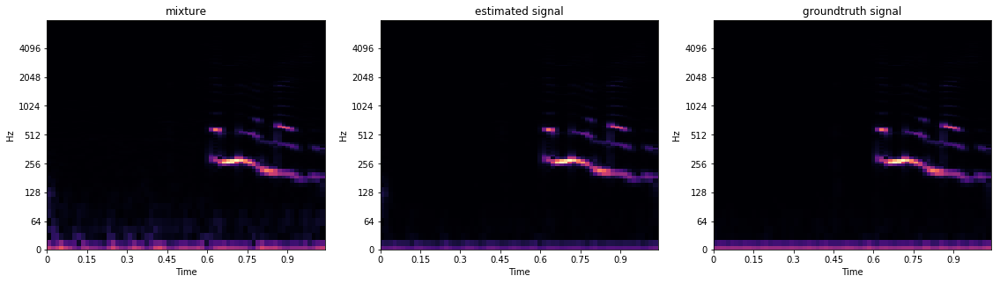

# Deep Complex U-Net
---
**Unofficial** PyTorch Implementation of [Phase-Aware Speech Enhancement with Deep Complex U-Net](https://openreview.net/forum?id=SkeRTsAcYm), (H. Choi et al., 2018) 
> **Note**
>
> This is NOT author's implementation.


## Architecture
---
(TO BE) 


## Requirements
```text
torch==1.1
soundfile==0.9.0
easydict==1.9
git+https://github.com/keunwoochoi/torchaudio-contrib@61fc6a804c941dec3cf8a06478704d19fc5e415a
git+https://github.com/sweetcocoa/PinkBlack@e45a65623c1b511181f7ea697ca841a7b2900f17
torchcontrib==0.0.2
git+https://github.com/vBaiCai/python-pesq
# gputil # if you need to execute multiple training process
```

## Train
---
1. Download Datasets:
- [https://datashare.is.ed.ac.uk/handle/10283/2791](https://datashare.is.ed.ac.uk/handle/10283/2791)

2. Separate each train / test wavs

3. Downsample wavs
```bash
# prerequisite : ffmpeg.
# sudo apt-get install ffmpeg (Ubuntu)
bash downsample.sh   # all wavs below $PWD will be converted to .flac, 16k samplerate
```

4. Train
```bash
python train_dcunet.py --batch_size 12 \
                       --train_signal /path/to/train/clean/speech/ \
                       --train_noise /path/to/train/noisy/speech/ \
                       --test_signal /path/to/test/clean/speech/ \
                       --test_noise /path/to/test/noisy/speech/ \
                       --ckpt /path/to/save/checkpoint.pth \
                       --num_step 50000 \
                       --validation_interval 500 \
                       --complex

# You can check other arguments from the source code. ( Sorry for the lack description. )                        
```

## Test
---
```bash
python estimate_directory.py --input_dir /path/to/noisy/speech/ \
                             --output_dir /path/to/estimate/dir/ \
                             --ckpt /path/to/saved/checkpoint.pth
```


## Results
---
| PESQ(cRMCn/cRMRn)   | Paper | Mine* |
| -------------------- | ----- | ---- |
| DCUNet - 10     |  **2.72**/2.51  | 3.03/**3.07**  |
| DCUNet - 20| **3.24**/2.74  | **3.12**/3.11 |

- *cRMCn* : Complex-valued input/Output
- *cRMRn* : Real-valued input/Output

Comparing the two(Paper's, Mine) values above is inappropriate for the following reasons:

- \* I did not use matlab code that the author used to calculate pesq, but instead used [pypesq](https://github.com/vBaiCai/python-pesq).

- \* The Architecture of model is slightly different from the original paper. (Such as kernel size of convolution filters) 

- MelSpec


## Notes
---
- Log amplitute estimate has slightly worse performance than non-log amplitude
- Complex-valued network does not make the metric better..

## Sample Wavs
---
| Mixture | Estimated Speech | GT(Clean Speech) |
| --------|-----------|-------------|
|[mixture1.wav](./assets/noisy/p232_001.flac?raw=true)|[Estimated1.wav](./assets/estimated/p232_001.flac?raw=true)|[GroundTruth1.wav](./assets/gt/p232_001.flac?raw=true)|
|[mixture2.wav](./assets/noisy/p232_005.flac?raw=true)|[Estimated2.wav](./assets/estimated/p232_005.flac?raw=true)|[GroundTruth2.wav](./assets/gt/p232_005.flac?raw=true)|


## Contact
---
- Jongho Choi(sweetcocoa@snu.ac.kr / Seoul National Univ., ESTsoft )
